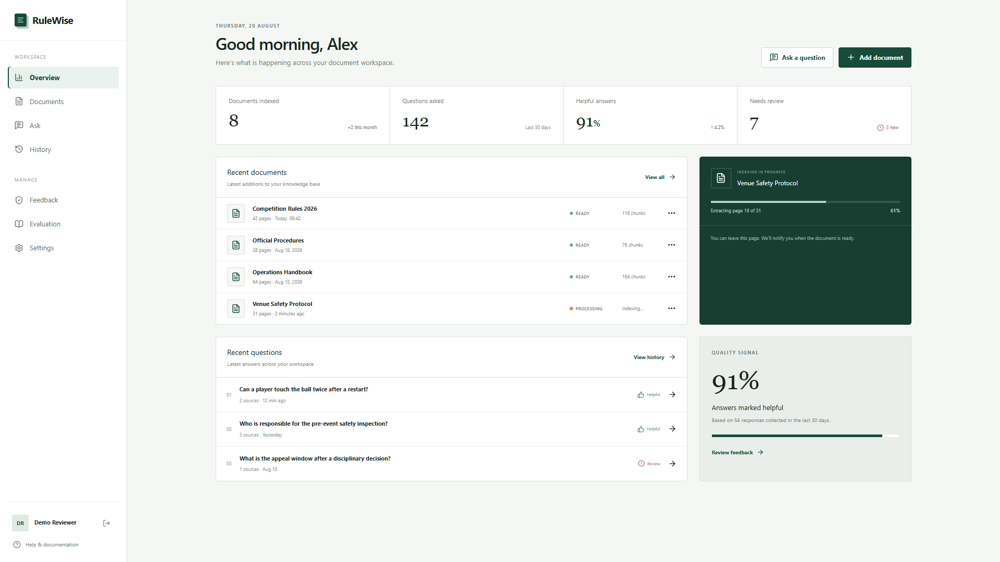
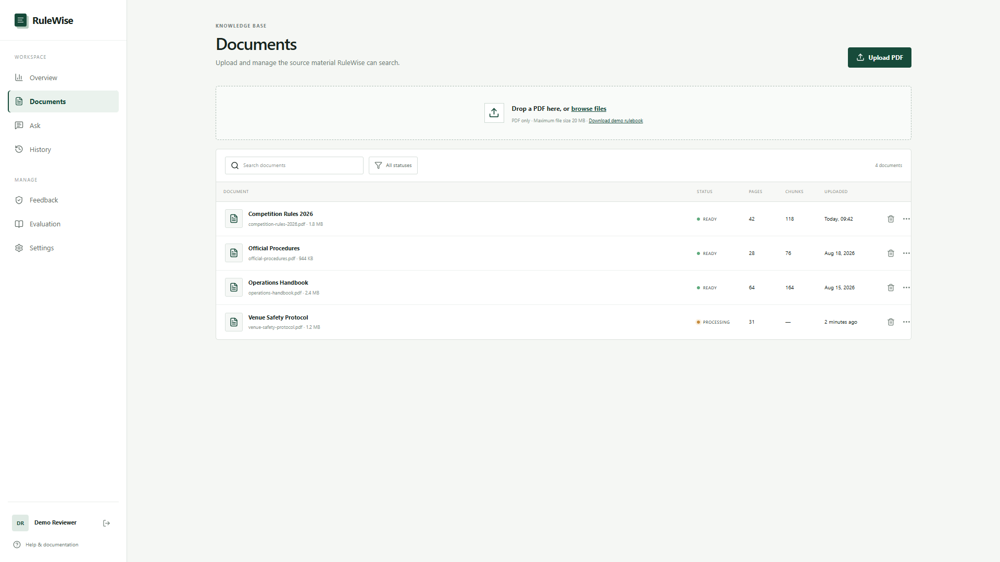
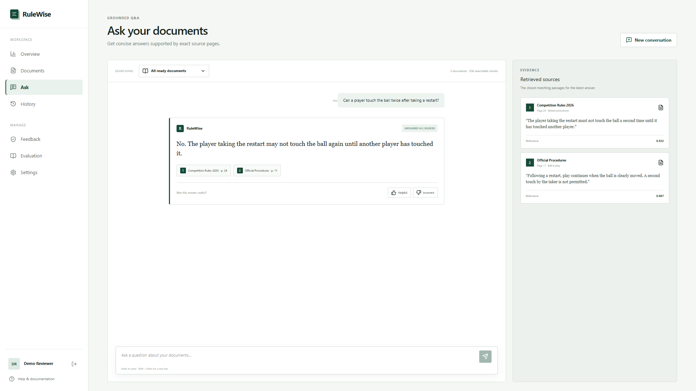
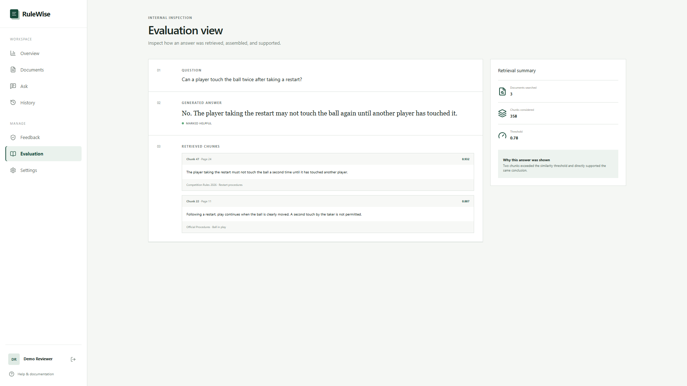
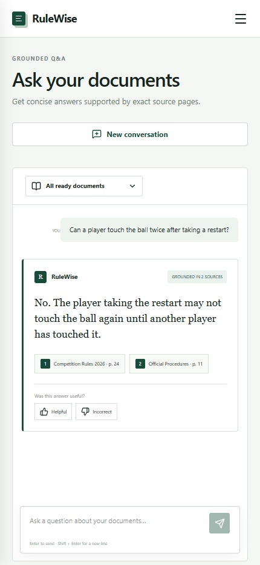
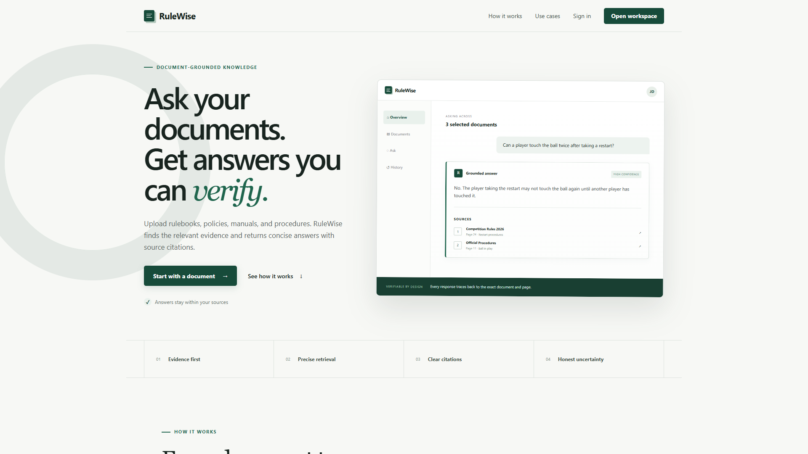

# RuleWise

RuleWise is a document-grounded knowledge assistant for PDFs, policies, manuals, and rulebooks. Users can upload documents, ask questions, and receive evidence-based answers with source citations.

## Features

- PDF ingestion with file validation and document processing states
- Page-aware text extraction and overlapping chunk generation
- OpenAI embeddings with PostgreSQL and pgvector retrieval
- Source-grounded answers with configurable evidence thresholds
- Citations containing document, page, passage, and similarity metadata
- Per-user documents, conversation history, and Helpful / Incorrect feedback
- Evaluation and debug views for retrieved chunks and relevance scores
- Supabase authentication, private Storage, and row-level security
- Responsive landing page and authenticated workspace
- Loading, empty, validation, insufficient-evidence, and failure states

## Screenshots

### Dashboard



### Documents



### Grounded Answer



### Evaluation



### Mobile



### Landing Page



## Demo Video

The repository includes a concise end-to-end product walkthrough at [`portfolio/rulewise-demo-final.webm`](portfolio/rulewise-demo-final.webm).

## Tech Stack

- React 19 and TypeScript
- Tailwind CSS 4
- Supabase Auth and private Storage
- PostgreSQL with pgvector and row-level security
- OpenAI Responses and Embeddings APIs
- PDF.js for browser-side PDF text extraction
- Zod for request validation
- Vinext for Next.js-compatible routing, server handlers, and builds
- Lucide React icons
- Node.js test runner and ESLint

## Architecture

```text
PDF upload
  → text extraction
  → chunking
  → embeddings
  → pgvector
  → similarity search
  → grounded answer
  → citations
```

Text is extracted per page and split into overlapping chunks before embeddings are stored in pgvector. Similarity search is scoped to the authenticated user and applies an evidence threshold before retrieved passages reach the answer model.

Citation metadata is stored separately from generated text so each answer can retain its document, page, passage, and similarity references. Uploaded files remain in a private Supabase bucket, and row-level security protects all user-owned records.

### Demo Mode

Browser-side retrieval provides a local review path for uploaded PDFs without invoking the hosted answer endpoint. It keeps the portfolio and demo workflow usable without requiring the complete Supabase and OpenAI environment.

## Getting Started

Requirements:

- Node.js 22.13 or later
- A Supabase project
- An OpenAI API key for the hosted embeddings and answer flow

```bash
npm install
cp .env.example .env.local
npm run dev
```

On Windows PowerShell, replace the copy command with:

```powershell
Copy-Item .env.example .env.local
```

The development server prints the local URL after startup.

## Environment Variables

Copy [`.env.example`](.env.example) and provide values only in your local `.env.local` file or hosting environment:

```env
NEXT_PUBLIC_SUPABASE_URL=
NEXT_PUBLIC_SUPABASE_PUBLISHABLE_KEY=
SUPABASE_SERVICE_ROLE_KEY=
OPENAI_API_KEY=
```

Never expose the service-role key or OpenAI key to browser code. Local environment files are ignored by Git.

## Database Setup

Apply the SQL migrations in order:

1. [`20260822000000_rulewise_accounts.sql`](supabase/migrations/20260822000000_rulewise_accounts.sql) creates profiles, per-user documents, extracted chunks, question history, private Storage policies, and row-level security.
2. [`20260823000000_rulewise_vector_search.sql`](supabase/migrations/20260823000000_rulewise_vector_search.sql) enables pgvector, adds embeddings and vector search, and creates conversations, messages, citations, indexes, grants, and ownership policies.

Use the Supabase CLI or run both files in the Supabase SQL editor. The first migration also creates the private `documents` Storage bucket.

## Testing

```bash
npm run lint
npm test
npm run build
```

These commands cover source linting, retrieval/grounding unit tests, and the production build.

## Demo Data

The interface uses synthetic competition-rule content for portfolio screenshots and UI review. A fictional source PDF is available at [`public/demo/fictional-competition-rules.pdf`](public/demo/fictional-competition-rules.pdf) and can be rebuilt with:

```bash
python scripts/create_demo_pdf.py
```

No private documents or production account data are included.

## Portfolio Note

RuleWise demonstrates full-stack development, document ingestion, semantic search, retrieval-augmented generation, source-grounded answers, citation handling, API integration, database design, authenticated data ownership, evaluation and debug tooling, and responsive UI.

## Author

[fada98](https://github.com/fada98)
